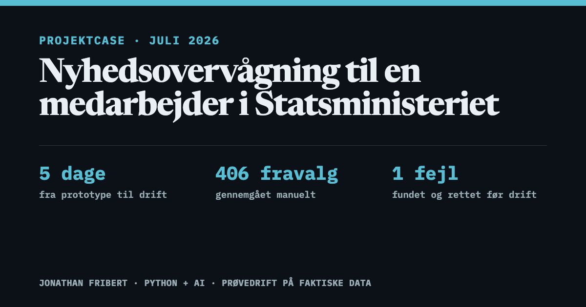

# Nyhedsmonitor — projektcase

**Læs casen:** [Dansk](https://jonathanfribert.github.io/nyhedsmonitor-case/) · [English](https://jonathanfribert.github.io/nyhedsmonitor-case/en.html)

[](https://jonathanfribert.github.io/nyhedsmonitor-case/)

Et personligt værktøj til nyhedsovervågning, bygget og sat i drift på fem kalenderdage.
Modtageren var en medarbejder i Statsministeriet, der var på standby i en
intensiv uge. Casen gennemgår arkitektur, test og drift med faktiske driftstal.
Selve monitorens kildekode er privat, fordi den rummer en målrettet kildeliste
og driftsopsætning til en konkret, tidsafgrænset opgave.

Kontakt: fribert6@gmail.com

## Kort fortalt

- Monitoren følger offentligt tilgængelige nyhedsmedier samt udvalgte konti på
  Truth Social og X.
- Faste regler fjerner gammelt og gentaget indhold, før en AI-model vurderer de
  resterende fund.
- Løsningen gik fra idé til drift på fem kalenderdage. Jeg kontrollerede 42
  X-konti, gennemgik manuelt 406 artikler og opslag og afsluttede med 26
  beståede test.

<details>
<summary><strong>Intern dokumentation for redigering og publicering</strong></summary>

## Intern dokumentation (for redigering af siden)

Dette repo indeholder casens danske og engelske HTML-side samt delekort på
begge sprog; resten af denne README er arbejdsdokumentation. Siderne er
selvstændige HTML-filer uden et build-trin.

**Hosting:** GitHub Pages fra dette repo (branch `main`, rod). Selve
monitorens kildekode ligger i det PRIVATE repo `JonathanFribert/nyhedsmonitor`
og skal forblive privat.

**Forsiden** (portfolio, avisforside) bor i repoet
`JonathanFribert/jonathanfribert.github.io` (lokalt:
`nyhedsmonitor/portfolio-site/`) og serveres på https://jonathanfribert.github.io/.
Casens avishoved-navn linker derover. Domænets gældende robots.txt ligger i
forsidens repo og peger på begge sitemaps; casens egen robots.txt er uden
virkning (ikke i roden).

## Publicering (efter ændringer i `index.html` eller `en.html`)

```
git add -A && git commit -m "beskrivelse"
git push origin main        # remote = det offentlige nyhedsmonitor-case-repo
```

Pages bygger automatisk ved push (typisk live inden for 1-2 min). Verificér
både `/` og `/en.html`, og kontrollér sprogskiftet på mobil og desktop.

OBS (set 13. juli 2026): Pages-konfigurationen kan forsvinde fra repoet, så
siden svarer 404, selv om push lykkes og koden er på main. En anden variant
(også set 13. juli): push lander på main, men Pages bygger bare ikke — bestil
da bygningen manuelt: `gh api -X POST repos/JonathanFribert/nyhedsmonitor-case/pages/builds`. Tjek med
`gh api repos/JonathanFribert/nyhedsmonitor-case/pages` og genaktivér med:
`gh api -X POST repos/JonathanFribert/nyhedsmonitor-case/pages -f "source[branch]=main" -f "source[path]=/"`

## Indhold og principper

- **Sandfærdighed er sidens valuta.** Alle tal stammer fra rigtige kørsler og
  logs (tragten: produktionskørslen 7. juli kl. 16.25; 406 fund: fire døgns
  prøvedrift; 97/100 kørsler og GDELTs 15/15 fejlsvar: driftstjek 13. juli).
  Det konstruerede mail-eksempel er eksplicit markeret som illustrativt. Lav
  ALDRIG tal eller citater om uden at opdatere kilden.
- **Statsministeriet nævnes bevidst** (hero, case-brief) med en tydelig
  disclaimer om, at værktøjet er personlig støtte, ikke et officielt system.
  Ingen modtagernavne eller mailadresser må optræde på siden.
- **Sprogniveau:** hovedsporet skrives til en ikke-teknisk læser; tekniske
  detaljer bor i den foldbare "Se de tekniske detaljer". Terminologi:
  "fund" bruges som fast begreb efter første, selvforklarende brug. Udadtil
  siges "alvorlige fund" (ikke det interne "høj alvor"), "uafhængig
  overvågning" (ikke "driftsmonitor") og "alvorsgrad" som feltnavn; undgå
  kancelli-vendinger og ordgentagelser (sprogpas 12. juli efter brugerens
  feedback om spøjst sprog).
  De synlige emnelinjer er forenklede, læsevenlige eksempler. De bevarer
  rækkefølgen af alvorsgrad, antal fund og driftsstatus, men gengiver ikke de
  oprindelige forkortelser ordret.
- **Design ("Morgenavisen", besluttet 13. juli 2026):** fladt redaktionelt
  udtryk uden skygger/pills/hover-løft, nu i avis-palet: varmt papir #FAF7F0,
  blæk #1B1A17, avisblå accent #1F4E79, rustrød #A6301F KUN som alarmfarve,
  grøn #2F6B44 til levering (mørk tilstand: kul #141210, blæk #ECE7DC, lys
  avisblå #8FB4D9 — findes i TO CSS-blokke, der skal holdes i sync).
  Identitetsmotiv: avishoved med udgavelinje og klassisk dobbeltstreg (tyk
  over tynd) øverst; samme dobbeltstreg lukker siden over footeren.
  Sektionslabels er nummererede (01–08) i mono. Newsreader til overskrifter,
  IBM Plex Mono til etiketter og tal, lys/mørk via `prefers-color-scheme` +
  manuel knap. En tynd læseindikator under topbaren viser fremdriften på den
  lange side. Et diskret, cirkulært iris-skift bruges ved manuelt temaskift,
  og avishovedet folder let ind ved første visning. Bevægelse er ellers
  begrænset til et let fade på udvalgte hovedfigurer samt vækst i døgnbånd og
  tragtlinjer. Nøgletallene i toppen tæller op ved indsyn — BRUGERGODKENDT
  13. juli; effekten er to gange blevet fjernet i slutkontroller som "generisk",
  og brugeren har begge gange bedt om den igen. Fjern den ikke. Alt slås fra med
  `prefers-reduced-motion`. Alle tekst/baggrund-par er kontrolleret mod WCAG AA.
  Et meget let papirkorn (`opacity: .03`) binder fladerne sammen uden at gøre
  teksten urolig og skjules i tvungne kontrasttilstande. `og-image.png` og
  `og-image-en.png` (1200x630) er delekortene til LinkedIn m.m.; de redigerbare
  kilder er `og-template.html` og `og-template-en.html`. De bruger sidens
  skrifter Newsreader og IBM Plex Mono via Google Fonts. Regenerér PNG-filerne,
  hvis titel, nøgletal eller palet ændres:

  ```sh
  "/Applications/Google Chrome.app/Contents/MacOS/Google Chrome" --headless \
    --screenshot=og-image.png --window-size=1200,630 --hide-scrollbars \
    --virtual-time-budget=8000 "file://$PWD/og-template.html"
  "/Applications/Google Chrome.app/Contents/MacOS/Google Chrome" --headless \
    --screenshot=og-image-en.png --window-size=1200,630 --hide-scrollbars \
    --virtual-time-budget=8000 "file://$PWD/og-template-en.html"
  ```
- **Identitet og kontakt (besluttet 12. juli 2026):** siden er starten på
  Jonathans portfolio. Topbar og `<title>` bærer navnet Jonathan Fribert;
  avishovedets udgavelinje siger "Projektcase". Kontakt er
  fribert6@gmail.com (primær, synlig i CTA og footer) plus GitHub; bevidst
  ingen LinkedIn. Den foldbare teknikblok samler sprog, værktøjer, kilder,
  test og drift ét sted; døgnrytme-diagrammet i "Opgaven" viser overvågning
  24/7, levering kl. 8-17, fund gemt til morgenmailen og hastemails.
- **Sprogversioner:** `index.html` er dansk, `en.html` er engelsk. De skal have
  samme struktur, faktatal og sektioner. Begge sider har canonical- og
  `hreflang`-links, og sprogskiftet forsøger at bevare den aktuelle sektion.
  Avishovedets navn linker til forsiden: DA-siden til
  `https://jonathanfribert.github.io/`, EN-siden til `.../en.html`.

## Ugens afslutning (tjekliste, godkendt af Jonathan 14. juli)

Når standbyperioden slutter og monitoren pensioneres:

1. **Efterskriftet** opdateres med ugens SAMLEDE tal i begge sprogfiler.
   Tallene efterprøves først mod `gh run list -R JonathanFribert/nyhedsmonitor`
   (OBS: uden `-R` tælles det forkerte repos kørsler — det er sket).
2. **Case-briefens status** ændres fra drift til "Afsluttet efter planen
   [dato]" i begge sprogfiler. En case der slutter ryddeligt er et stærkt
   signal; lad datoen stå. Statusfeltets grønne stempel (`.status-stamp`,
   DA "I DRIFT" / EN "LIVE") skiftes samtidig til "AFSLUTTET" / "COMPLETED";
   behold den grønne farve, afslutning efter planen er positiv status.
3. **JSON-LD `dateModified`** og `sitemap.xml`-lastmod følger med.
4. **Forsiden** (portfolio-repoet) synkroniseres: nøgletal i begge sprog,
   kicker til afsluttet form, `live-dot` fjernes — se forsidens README.
5. Delekortene regenereres kun, hvis tallene på dem ændrer sig.
6. **Skærmbillede som bevis** (godkendt af Jonathan 15. juli): tag ét ægte
   skærmbillede af `gh run list -R JonathanFribert/nyhedsmonitor --limit 20`
   (terminal, grønne kørsler) eller healthchecks-historikken, og sæt det ind i
   sektion 07 eller teknik-folden i begge sprogfiler med dansk/engelsk alt-tekst.
   Kørselslisten indeholder ingen modtagernavne. Komprimér til web (maks ~150 kB).

### Klargjorte tekstudkast til flippet (indsæt tal, søg/erstat)

Case-brief status (DA/EN):

    I drift siden 11. juli 2026; tidsafgrænset til projektugen
    →  Afsluttet efter planen [DATO]. 2026 — i drift 11.–[SLUTDATO]. juli
    In operation since 11 July 2026; limited to the project week
    →  Completed as planned on [DATE] July 2026 — live 11–[END DATE] July

Stempel: `.status-stamp` DA "I DRIFT" → "AFSLUTTET", EN "LIVE" → "COMPLETED"
(grøn farve beholdes).

Efterskrift-sluttal (efterprøv med `gh run list -R JonathanFribert/nyhedsmonitor`):

    [ANTAL KØRSLER] kørsler i alt, [ANTAL FEJL] fejl ([FEJLPROCENT] % fejlfri)
    [ANTAL MAILS] leverede mails, heraf [ANTAL HASTE] hastemails
    Drop-audit: [ANTAL DROPS] frasorterede fund gennemgået, [ANTAL MISS] ægte miss

Efterskrift-rubrikken "Status efter de første tre døgn i drift" ændres til
"Sådan endte ugen" / EN "How the week ended".

## Historik

Bygget 12. juli 2026 i tre lag: Claude skrev første udgave (commit 313aa0b),
Codex redesignede til det nuværende flade udtryk med beslutningstræ og
takeaways, Claude bidrog med typografi-skala, sprogpas (jargon ud af
hovedsporet), og-image/delekort og publicering. 12. juli (senere samme dag):
det åbne designspørgsmål blev lukket ved at fjerne seks-trins-kørslen fra
"Løsningen" (den overlappede arkitekturdiagrammet); de to unikke detaljer
(X henter kun siden sidste kørsel; dedup på id/link/normaliseret titel) blev
flyttet ind i den tekniske foldeboks. Tankestreger i brødteksten blev erstattet
af kommaer, mens talintervaller som "kl. 8–17" blev beholdt. De rå emnelinjer
blev senere erstattet af tydeligt markerede, læsevenlige eksempler. Senere samme
dag, oprydningspas efter brugerens "siden ser
lidt rodet ud": beslutningstræet fjernet (dubleret af døgnrytme-diagrammet),
stats-labels og sektionsintroer forkortet, quick-head-sideteksten droppet, én
hero-CTA, h2/intro/quote skaleret ned, journey-kortene ensrettet til
accent/rød. Desuden GitHub profil-README oprettet (repo
JonathanFribert/JonathanFribert) med link hertil. Tredje pas: diskret
scroll-reveal (fade-op, staggered pr. søskendegruppe) og tragtsøjler/døgnbånd
der vokser frem ved indsyn; alt gated bag `.js-reveal` på `<html>` (sat af JS)
og `prefers-reduced-motion: no-preference`, så siden er fuldt synlig uden JS og
uden bevægelse for følsomme brugere. Plus ::selection i accentfarve. Fjerde pas: manuel lys/mørk-knap i topbaren.
Mekanik: uden valg følger siden systemet (media query); et klik sætter
`data-theme` på `<html>` og gemmer i localStorage (læses af et lille
head-script før første maling, så intet blink); vælges systemets eget tema,
ryddes valget, og siden følger systemet igen. De mørke FARVEVÆRDIER er
konsolideret (14/7) til én kilde: `--dark-*`-variablerne i `:root`. De to
selektorer (media-queryen gated med `:not([data-theme="light"])` og
`[data-theme="dark"]`) mapper begge de samme `--dark-*`-værdier — ret
farver ét sted, i paletten. Mappingerne skal fortsat findes i begge blokke,
men indeholder ingen hexkoder. Konsolideringen er pixel-verificeret identisk
i alle fire tilstande (lys, system-mørk, tvunget mørk, tvunget lys).
Knappen opdaterer også begge theme-color-metatags.

Femte pas samme dag: mobilnavigationen blev gjort ikke-scrollende med tre
synlige links og en separat 44 x 44 px temaknap. Figurtekster blev hævet til
mindst 14 px på mobil, scrollindikatoren blev fjernet, og scroll-reveal blev
begrænset til fem hovedfigurer uden stagger. Den dobbelte teknikforklaring blev
samlet i én foldbar blok, driftslaget i arkitekturfiguren blev forkortet, og
projektstatus, mailadfærd, auditlog og økonomi blev beskrevet mere præcist.

13. juli 2026, "Morgenavisen"-redesign (Claude, efter brugerens valg af
retning): (A) avis-paletten ovenfor erstattede den kølige teal-palet i begge
temaer; theme-color, favicon, print og JS-tema-synk fulgte med; alle tekstpar
kontrastkontrolleret. (B) hero omkomponeret som avishoved (udgavelinje +
dobbeltstreg, eyebrow-elementet udgik), sektionslabels nummereret 01–08 i
mono, footer fik samme dobbeltstreg. (C) figursprog ensrettet: mail-mock med
avisblå toplinje, figurtitler med ens underlinje, tragt i avisblå med rød
slutrække. (D) og-image regenereret i avis-stil med den aktuelle rubrik.
Codex' sprogpas fra samme formiddag blev committet separat forinden og er
fuldt bevaret.

13. juli: Et samlet sprogpas gjorde nøgletallene til hele sætninger, oversatte
interne driftsord i hovedsporet og omskrev driftsfejlenes løsningsbeskrivelser.
Tekniske begreber blev enten forklaret eller flyttet til teknikfolden. De
mindste diagramtekster blev samtidig gjort større på desktop.

Et afsluttende læsbarhedspas erstattede de rå, forkortede emnelinjer med tydeligt
markerede eksempler og ændrede blandt andet "fravalg", "samme kørsel" og
"systemet set ovenfra" til mere almindeligt dansk.

Slutkontrollen efter de parallelle Claude/Codex-pas fjernede den generiske
talanimation, genindførte den dokumenterede vækst i døgn- og tragtdiagrammerne
og forbedrede visningen ved 320–420 px. En diskret læseindikator blev tilføjet
som eneste nye globale effekt.

13. juli, afsluttende pas: Casen fik en fuld engelsk version med sprogskift,
egne metadata og eget delekort. Heroen forklarer nu brugerens konkrete gevinst
og relationen til Statsministeriet tydeligere, mens driftserfaringerne står
efter "Min rolle". Siden dokumenterer nu også driftstjekket af 100 kørsler,
den målrettede Google News-søgning afgrænset til nato.int og beslutningen om at
slå GDELT fra efter 15 kørsler uden brugbare svar. Monitorens sidste
regressionsrunde endte med 26 beståede test. Papirkornet blev dæmpet, og
temaskiftets iris, avishovedets fold og de sekventielle diagramanimationer blev
bevaret som de få bevidste effekter.

13. juli, pas 3-effekter (Claude, i BEGGE sprogfiler — hold dem i sync):
figurtitlernes underlinje tegnes fra venstre ved afsløring, kildestatuslinjen
i mail-mocken skriver sig selv som en telegraflinje (fuld tekst i aria-label
og uden JS), og HASTER-blokken i journey-eksemplet giver ét enkelt pulsslag,
aldrig i loop. Alt gated bag js-reveal + prefers-reduced-motion. Påstanden
"97 af 100 kørsler uden fejl" er efterprøvet mod GitHub Actions (97 success,
3 failure i seneste 100), og begge sider siger 26 test, hvilket matcher
testsuiten (Ran 26 tests, OK).

13. juli, klarheds- og effektpas (Claude, efter brugerens feedback om internt
sprog, manglende ord og utydelighed): Papirkornet flyttet fra et fixed
overlay OVER al tekst til html-baggrundslaget (background-blend-mode; opacitet
bagt ind i SVG'en som 0.055) — teksten er skarp igen, og det var hovedaarsagen
til utydeligheden. Broedtekstgraa moerknet (#6B675E -> #605C53), koestribernes
moenster daempet. Sprogpas i begge filer: manglende "som" indsat,
"gemning"/"ramme samme hukommelse"/"paa et andet tidspunkt" omskrevet,
GDELT forklaret som nyhedsdatabase ved foerste omtale, rate-limit-statuslinjen
forklaret i klartekst, "casesiden" -> "her paa siden". Nye effekter (begge
filer): @view-transition navigation:auto (bloedt skift DA<->EN og intern
navigation, Chrome 126+), :target-sweep paa sektionslabels, og "nu"-viser i
doegnbaandet (lodret streg + klokkeslaet i dansk tid via Intl/Europe/Copenhagen;
information, ikke bevaegelse, saa den er aktiv uanset reduced motion; label
udelades naar den ville kollidere med akseticks).

13. juli, femte runde (Claude, paa brugerens bestilling): (1) Doegnbaandets
akse skriver nu kl. 00:00/08:00/17:00/24:00, saa den matcher nu-viserens
"nu 15:00" (EN havde allerede formatet). (2) Ny EFTERSKRIFT-sektion foer
Kontakt med verificerede driftstal pr. 13. juli (100 koersler siden go-live,
97 uden fejl, GDELT slaaet fra, manuel drop-gennemgang uden fund) — SKAL
OPDATERES med ugens samlede tal, naar standbyperioden slutter; tallene
efterproeves moed gh run list foer opdatering. (3) JSON-LD (schema.org
Article + Person) i begge sider; valideret med json.loads. (4) Print:
@page-margener, beforeprint folder teknikdetaljer ud (og lukker dem igen),
knapper og laeseindikator skjules, figurer bryder ikke over sider, footeren
viser sidens URL i print. (5) HASTER-badgen er nu et stempel (roteret, rammet)
der stemples ned ved afsloering (afloeser pulsslaget), plus mikro-hovers paa
kildenoder og filterchips. Alt i BEGGE sprogfiler.

13. juli, revisionspas (Claude): fuld detaljerevision. Fundet og rettet:
DA-siden manglede og:locale (nu da_DK + alternate en_GB, spejlet paa EN);
sprogskiftet bevarer nu faktisk den aktuelle sektion (navObserver opdaterer
.language-switch-href med #sektion — README paastod det foer koden kunne det);
brandet 404.html i avis-stil (FRASORTERET-stempel, tosproget, noindex);
sitemap.xml med hreflang-alternates + robots.txt; temaknappens ikon vipper
ved hover. Revideret uden fund: ankre/id'er/aria-labelledby, dublerede id'er,
overskriftshierarki (h1=1, ingen niveauspring), JSON-LD-parse, sitemap-XML.

14. juli (Claude, efter brugerfeedback): (1) Nu-viseren har nu et ALTID
synligt flag med sekundviser ("nu HH:MM:SS", dansk tid, tikker hvert sekund,
kant-klemmes ved 0/24); den gamle akse-label med kollisionsvagt udgik.
(2) "Nyt nok" erstattet med "Stadig aktuelt" i chips, tjekliste og tragt
(EN: "Still current") efter feedback om internt sprog. (3) Mail-mockens
kildelinje ombrydes i stedet for at klippe. (4) Efterskrift opdateret til
145/141 koersler pr. 14. juli (fjerde fejl verificeret som samme state-race
som de tre foerste); dateModified og sitemap fulgte med. OBS driftsnote:
state-racet optraeder stadig (~3 %) trods adskilte tidsplaner — kendt,
ufarligt for levering, men naevnes ved naeste efterskrift-opdatering.

14. juli, pas 2 (Claude, paa Jonathans bestilling): (1) Forsiden fik fuld
engelsk udgave (en.html i portfolio-repoet) med sprogskifte i topbaren;
casens EN-avishoved linker nu til forsidens en.html, DA fortsat til roden.
(2) Ny sektion "Ugens afslutning (tjekliste)" ovenfor — efterskriftets
sluttal OG case-briefens skift til "Afsluttet efter planen" er godkendt af
Jonathan. (3) State-racet analyseret til bunds: GitHubs concurrency-laas har
vaeret i monitor-workflowet fra foerste commit og er beviseligt utaet for
koersler startet sekunder fra hinanden (kollisionen 14/7 kl. 03:31 skete MED
laasen); kuren er merge-drivere i monitor-repoet (union for jsonl-logs,
"tag den rebasede koersels version" for seen.json) og ligger som diff, der
afventer groent lys. Kuren fik groent lys senere samme dag, er pushet
(a989d83) og foerste koersel paa den var groen.

14. juli, pas 3 (Claude, fem bestilte rettelser): (1) Datid rettet til nutid
i case-briefens status ("I drift siden 11. juli 2026") og systemdiagrammets
figcaption, saa de ikke modsiger efterskriftets aktive drift. (2) Moerk
palet konsolideret til een vaerdikilde (--dark-* i :root; begge selektorer
mapper samme saet) — pixel-verificeret identisk i fire tilstande, se
temaafsnittet. (3) .quick-step fik hover (accent-soft baggrundsskift som
.filter-row, i samme hover:hover-gate). (4) Groent I DRIFT/LIVE-stempel
(.status-stamp, aria-hidden) ved statusfeltet i case-briefen, samme
stempelsprog som HASTER men groen = positiv status; skiftes ved ugens
afslutning, se tjeklisten. (5) Diskret spalte-streg (masthead-dobbeltstregen
paa hoejkant, daempet linjefarve via color-mix) i hoejre margen af
.prose/.delivery-intro i #problem og #efterskrift; fjernes under
tvangsfarver/hoej kontrast og i print ligesom papirkornet.

</details>
